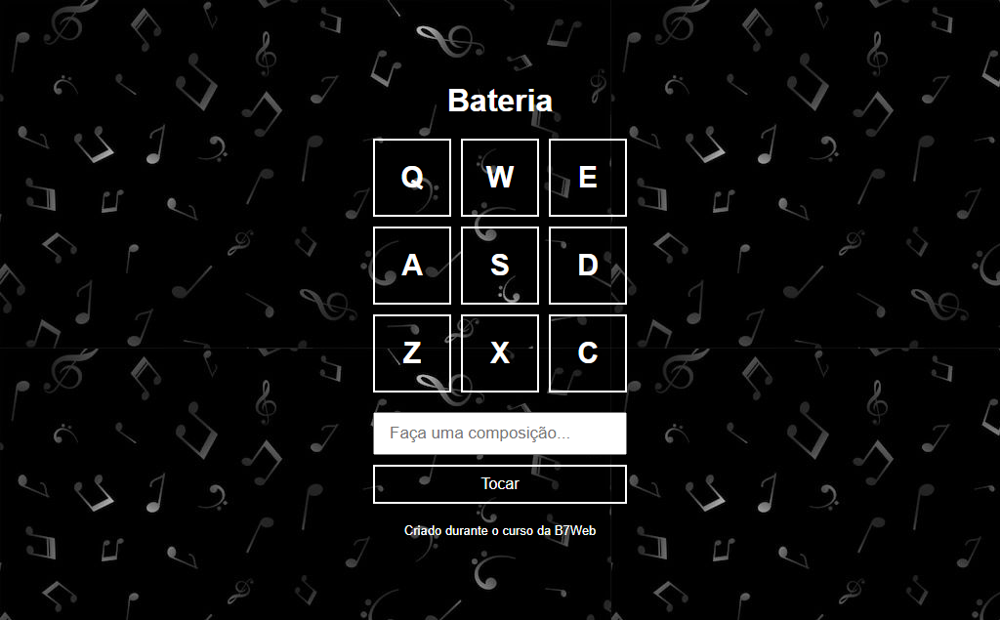

# Bateria

> Bateria

Esse é o projeto Bateria criado no curso da B7Web.

[Clique para acessar](https://guimiiller.github.io/bateria/)

## 🚀 Tecnologias

- HTML
- CSS
- JavaScript
- Git e Github

## 💻 O que aprendi

- Aprendi a transformar strings em array 
- Aprendi a manipular a tag audio
- Aprendi a fazer troca de classes de elementos

## 📨 Contato

- guilhermemillerblack@gmail.com